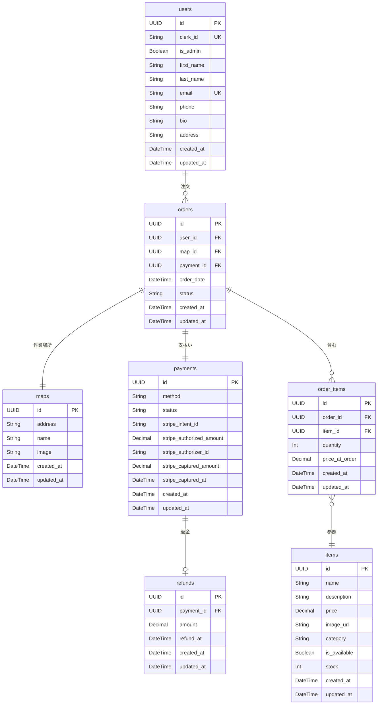

# 四季守 (Shikimori) 🌸

> 四季を通じて地域をサポートする重機除雪・草刈りサービス。Next.js, Clerk, Supabase で構築された地域サポートプラットフォーム

## 📋 概要

四季守（Shikimori）は、秋田県内を中心とした除雪・草刈りサービスのオンライン予約・管理プラットフォームです。地域住民の除雪・草刈りの負担を軽減し、サービス提供業者とのマッチングを効率化することを目的としています。

### 主な機能
- ユーザー向け: サービス閲覧、プロフィール管理、お問い合わせ、ニュースレター登録
- 管理者向け: ユーザー管理、商品管理、注文管理

## 🛠️ 技術スタック

### フレームワーク・言語


### UI


### 状態管理/フォーム


### 認証/データベース


### その他


## ✨ 機能一覧

### ユーザー向け機能
- ユーザー登録・ログイン (Clerk)
- プロフィール表示・編集・削除
- サービス（商品）一覧表示
- サービス詳細表示
- お問い合わせフォーム
- ニュースレター登録
- 特徴・サービス紹介セクション
- テスティモニアル（お客様の声）表示
- （将来実装予定: サービス予約、決済機能）

### 管理者向け機能
- 管理者ダッシュボード
- ユーザー管理（一覧表示、詳細表示、編集）
- 商品管理（一覧表示、CRUD操作）
- 注文管理（将来実装予定）

### 共通機能
- ダークモード対応
- レスポンシブデザイン
- アニメーションエフェクト（Framer Motion）
- カルーセル表示（Embla Carousel）

## 📁 プロジェクト構造

```
shikimori/
├── app/                  # Next.js App Routerのルートディレクトリ
│   ├── api/              # APIエンドポイント
│   │   ├── admin/        # 管理者用API
│   │   └── webhook/      # Webhook処理
│   ├── admin/            # 管理者向け画面
│   │   ├── items/        # 商品管理
│   │   └── users/        # ユーザー管理
│   ├── about/            # 会社概要ページ
│   ├── menu/             # サービスメニューページ
│   ├── profile/          # ユーザープロフィール関連画面
│   └── components/       # ページ固有のコンポーネント
├── components/           # 共通UIコンポーネント (shadcn/uiベース)
│   └── ui/               # shadcn/uiコンポーネント
├── lib/                  # ユーティリティ、ヘルパー関数、カスタムフック
│   ├── supabase/         # Supabase関連
│   └── authUtils.ts      # 認証ユーティリティ
├── prisma/               # Prismaスキーマ、マイグレーション、シードスクリプト
├── public/               # 静的ファイル (画像、SVGなど)
├── types/                # TypeScriptの型定義
├── data/                 # ナビゲーションなどの静的データ
└── docs/                 # ドキュメント (ER図など)
```

## 📊 データベーススキーマ (ER図)

以下は初期（※）のデータベーススキーマをER図で表したものです：



### テーブル関連図の説明

- **users**: ユーザー情報を管理するテーブル。Clerk認証と連携
- **items**: 提供するサービス（商品）情報を管理するテーブル
- **orders**: 注文情報を管理するテーブル。ユーザー、地図、支払い情報と関連
- **maps**: 作業場所の情報を管理するテーブル
- **payments**: 支払い情報を管理するテーブル
- **refunds**: 返金情報を管理するテーブル
- **order_items**: 注文に含まれる商品（サービス）の中間テーブル

## 🚀 セットアップ手順

### 前提条件
- Node.js（v18以降推奨）
- Bun (v1.x)
- Git

### インストール手順

1. **リポジトリのクローン**
```bash
git clone <repository-url>
cd shikimori
```

2. **依存関係のインストール**
```bash
bun install
```

3. **環境変数の設定**
`.env.local` ファイルを作成し、以下の環境変数を設定します：
```
NEXT_PUBLIC_CLERK_PUBLISHABLE_KEY=
CLERK_SECRET_KEY=
NEXT_PUBLIC_CLERK_SIGN_IN_URL=
NEXT_PUBLIC_CLERK_SIGN_UP_URL=
NEXT_PUBLIC_CLERK_AFTER_SIGN_IN_URL=
NEXT_PUBLIC_CLERK_AFTER_SIGN_UP_URL=
CLERK_WEBHOOK_SECRET=

NEXT_PUBLIC_SUPABASE_URL=
NEXT_PUBLIC_SUPABASE_ANON_KEY=
DATABASE_URL=

# 任意: RLSバイパス用
SUPABASE_SERVICE_ROLE_KEY=
```

4. **データベースマイグレーション**
```bash
bunx prisma migrate dev
```

5. **データベースシーディング (任意)**
```bash
bunx prisma db seed
```

6. **開発サーバーの起動**
```bash
bun dev
```

7. **アクセス**  
ブラウザで http://localhost:3000 を開きます。

## 📝 利用可能なスクリプト

```bash
# 開発サーバーを起動
bun dev

# 本番用にアプリケーションをビルド
bun build

# ビルドされたアプリケーションを起動
bun start

# ESLintを実行してコードをチェック
bun lint

# データベースにサンプルデータを投入
bun db:seed
# または
bunx prisma db seed

# Prismaマイグレーションを実行
bunx prisma migrate dev

# Prismaクライアントを生成
bunx prisma generate
```

## 🌐 APIエンドポイント

- `/api/admin/users` - ユーザー一覧取得・作成API
- `/api/admin/users/[userId]` - 特定ユーザーの取得・更新・削除API
- `/api/admin/items` - 商品一覧取得・作成API
- `/api/admin/items/[itemId]` - 特定商品の取得・更新・削除API
- `/api/webhook/clerk` - Clerk認証Webhook（ユーザー作成・更新・削除イベント処理）

## 🚢 デプロイ

四季守は [Vercel Platform](https://vercel.com) へのデプロイを推奨しています。

### デプロイ手順

1. [Vercel](https://vercel.com) にアカウントを作成します。
2. プロジェクトをインポートします。
3. 環境変数を設定します（セットアップ手順の環境変数と同じ）。
4. デプロイボタンをクリックします。

詳細は [Next.js デプロイドキュメント](https://nextjs.org/docs/app/building-your-application/deploying) を参照してください。

## 📄 ライセンス

<!-- ライセンス情報をここに追加 -->

---

四季守 (Shikimori) - 四季を通じて地域をサポートするサービス 🌸
****