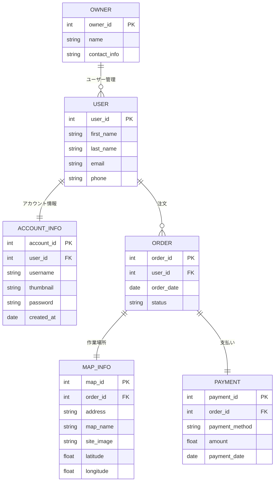

## ER図

```mermaid
erDiagram

%% エンティティ定義
OWNER ||--o{ USER : "ユーザー管理"
USER ||--|| ACCOUNT_INFO : "アカウント情報"
USER ||--o{ ORDER : "注文"
ORDER ||--|| MAP_INFO : "作業場所"
ORDER ||--|| PAYMENT : "支払い"

%% エンティティ詳細
OWNER {
  int owner_id PK
  string name
  string contact_info
}

USER {
  int user_id PK
  string first_name
  string last_name
  string email
  string phone
}

ACCOUNT_INFO {
  int account_id PK
  int user_id FK
  string username
  string thumbnail
  string password
  date created_at
}

ORDER {
  int order_id PK
  int user_id FK
  date order_date
  string status
}

MAP_INFO {
  int map_id PK
  int order_id FK
  string address
  string map_name
  string site_image
  float latitude
  float longitude
}

PAYMENT {
  int payment_id PK
  int order_id FK
  string payment_method
  float amount
  date payment_date
}
```