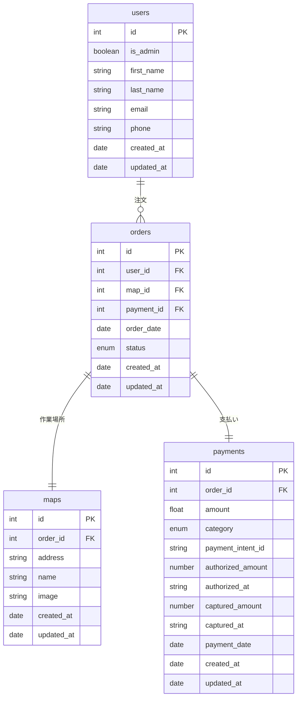

## ER 図

```mermaid
erDiagram

%% エンティティ定義
users ||--o{ orders : "注文"
orders ||--|| maps : "作業場所"
orders ||--|| payments : "支払い"

%% エンティティ詳細
users {
  int id PK
  boolean is_admin
  string first_name
  string last_name
  string email
  string phone
  date created_at
  date updated_at
}

orders {
  int id PK
  int user_id FK
  int map_id FK
  int payment_id FK
  date order_date
  enum status
  date created_at
  date updated_at
}

maps{
  int id PK
  int order_id FK
  string address
  string name
  string image
  date created_at
  date updated_at
}

payments {
  int id PK
  int order_id FK
  float amount
  enum category
  string payment_intent_id
  number authorized_amount
  string authorized_at
  number captured_amount
  string captured_at
  date payment_date
  date created_at
  date updated_at
}
```
