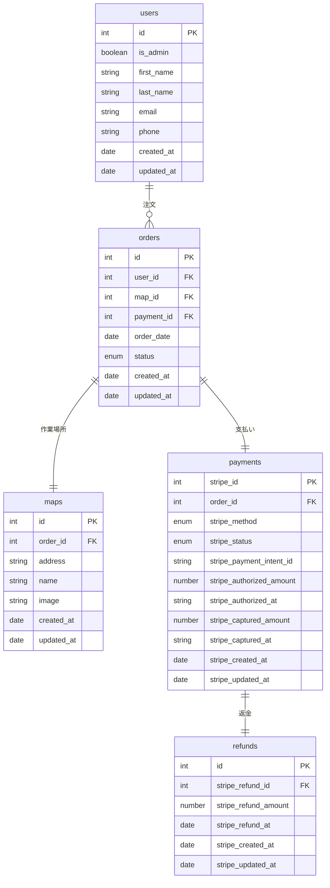

## ER 図

```mermaid
erDiagram

%% エンティティ定義
users ||--o{ orders : "注文"
orders ||--|| maps : "作業場所"
orders ||--|| payments : "支払い"
payments ||--|| refunds : "返金"

%% エンティティ詳細
users {
  int id PK
  boolean is_admin
  string first_name
  string last_name
  string email
  string phone
  date created_at
  date updated_at
}

orders {
  int id PK
  int user_id FK
  int map_id FK
  int payment_id FK
  date order_date
  enum status
  date created_at
  date updated_at
}

maps{
  int id PK
  int order_id FK
  string address
  string name
  string image
  date created_at
  date updated_at
}

refunds {
  int id PK
  int stripe_refund_id FK
  number stripe_refund_amount
  date stripe_refund_at
  date stripe_created_at
  date stripe_updated_at
}


payments {
  int stripe_id PK
  int order_id FK
  enum stripe_method
  enum stripe_status
  string stripe_payment_intent_id
  number stripe_authorized_amount
  string stripe_authorized_at
  number stripe_captured_amount
  string stripe_captured_at
  date stripe_created_at
  date stripe_updated_at
}
```
